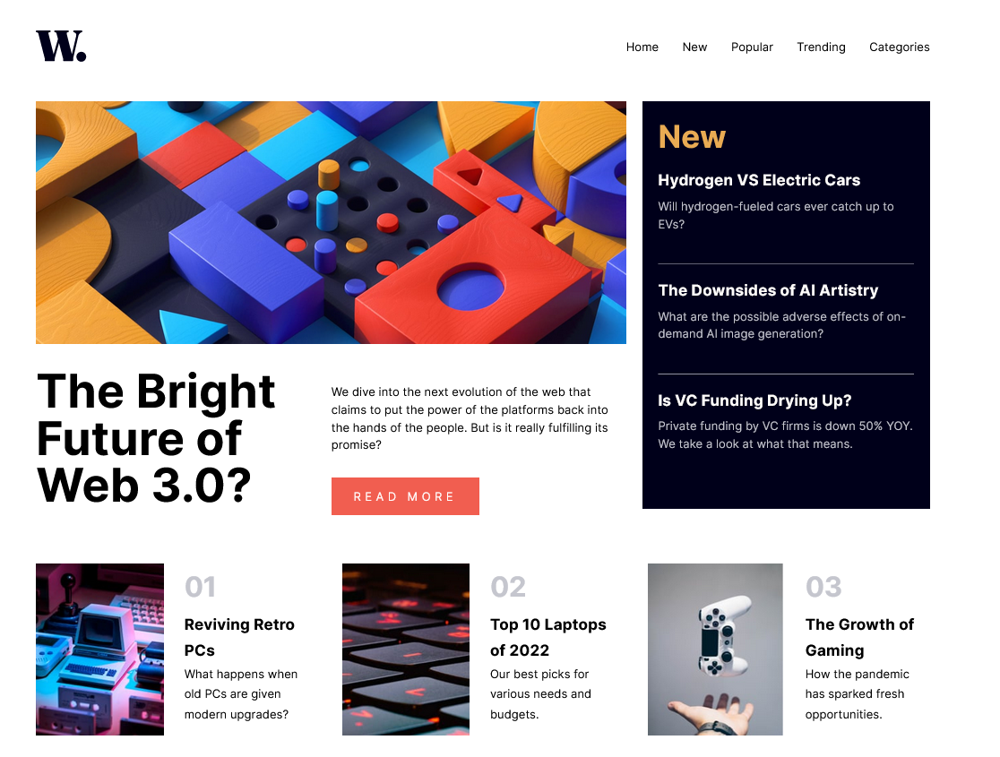

# Frontend Mentor - News homepage solution

This is a solution to the [News homepage challenge on Frontend Mentor](https://www.frontendmentor.io/challenges/news-homepage-H6SWTa1MFl). Frontend Mentor challenges help you improve your coding skills by building realistic projects. 

## Table of contents

- [Overview](#overview)
  - [The challenge](#the-challenge)
  - [Screenshot](#screenshot)
  - [Links](#links)
- [My process](#my-process)
  - [Built with](#built-with)
  - [What I learned](#what-i-learned)
  - [Continued development](#continued-development)
  - [Useful resources](#useful-resources)
- [Author](#author)
- [Acknowledgments](#acknowledgments)

**Note: Delete this note and update the table of contents based on what sections you keep.**

## Overview

### The challenge

Users should be able to:

- View the optimal layout for the interface depending on their device's screen size
- See hover and focus states for all interactive elements on the page
- **Bonus**: Toggle the mobile menu (requires some JavaScript)

### Screenshot

### Links

- Solution URL: [Github](https://github.com/Odiesta/news-homepage-main)
- Live Site URL: [Netlify](https://stately-madeleine-461fca.netlify.app/)

## My process

### Built with

- Semantic HTML5 markup
- Sass
- Flexbox
- CSS Grid
- Javascript DOM

### What I learned

I learn and practice a lot of CSS Grid. Setting the grid for responsive is one of the challenging thing to create. It takes me days to figure out. The navigation part was also hard. but i figure it out.

In creating the mobile navigation i just create a separate navigation that only shown in smaller screen (600px).

I think i need complex code in javascript but it was very simple. I just need to create a function that add and remove class.

### Continued development

This project is good, i practice writing html, css, javascript from scratch. Not like i've done before like watching tutorial and doing challenge from tutorial. I plan to go deeper to javascript.

### Useful resources

- [Offcanvas Navigation](https://www.w3schools.com/howto/howto_js_off-canvas.asp) - This helped me create offcanvas navigation
- [Advanced CSS Udemy Course](https://www.udemy.com/course/advanced-css-and-sass/) - This amazing course teach me very well in using CSS Grid.
- [Complete Javascript Udemy Course](https://www.udemy.com/course/the-complete-javascript-course/) - This course helped me understand and write javascript DOM.
- [Overlay background](https://www.w3schools.com/howto/howto_css_overlay.asp) - This site is where i found how to create overlay background

## Author

- Website - [Odiesta Shandikarona](https://github.com/Odiesta)
- Frontend Mentor - [@Odiesta](https://www.frontendmentor.io/profile/Odiesta)
- Twitter - [@OdiestaS](https://twitter.com/OdiestaS)
